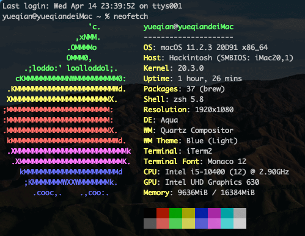

## i5-10400 + 微星 MSI-B460M-MORTAR

- 本 EFI 引用自 [@myqqiu](https://github.com/myqqiu) 的黑果项目 [Hackintosh B460M-MORTAR-i5 10500](https://github.com/myqqiu/Hackintosh-B460M-MORTAR-i5-10500-iGPU-UHD630)，在实践中做了自己的修改
- win + Mac 双系统安装教程，请参考 [新手挑战黑苹果-超详细的OpenCore黑苹果安装教程](https://www.bilibili.com/video/BV18V41187JZ?from=search&seid=16401274689611028077)，步骤很详细

#### 系统更新记录

- 2021-7-13 更新 openCore 0.7.0 & Big Sur 11.4，无异常

### 硬件配置

| 配置 | 型号             |
| ---- | ---------------- |
| CPU  | Intel i5-10400   |
| 主板 | MSI-B460M 迫击炮 |
| 内存 | 威刚 3000 8G\*2  |
| 硬盘 | 西数 SN720 1T    |
| 显卡 | 核显 UHD630      |
| 网卡 | fnvi T919        |

### CPU 支持

- [x] 支持所有 10 代核显为 UHD630 的 CPU
- [x] 无核显带 f 的 10 代 CPU，须使用免驱独显（无法使用核显加速）

### 显卡支持

- [x] 支持仅有 CPU 核显的 UHD630 显卡
- [x] 支持 AMD 独显 RX 470/480/570/570X/580/580X/590 系列显卡
  - 使用【独显】须在 BIOS 里强制打开 CPU 核显,否则核显硬件解码失效`（高级 -> 内建显示配置 -> 集成显卡多显示器(IGD Multi-monitor) -> 允许）`
  - 只使用核显可以忽略

### BIOS 版本

- 当前 BIOS 版本：7C82v13 &nbsp;&nbsp; [BIOS 下载地址](https://cn.msi.com/Motherboard/support/MAG-B460M-MORTAR)

### BIOS 设置

- USB 设备从 S3/S4/S5 唤醒：允许
- PS/2 鼠标从 S3/S4/S5 唤醒：允许
- USB 键盘从 S3/S4/S5 唤醒：任意键
- 集成显卡多显示器：允许（否则核显硬件解码失效，只使用核显的可以忽略）
- OC -> CPU 特征 -> Intel 虚拟化技术：允许
- OC -> CPU 特征 -> Intel VT-D 技术：禁止
- OC -> CPU 特征 -> CFG 锁定：禁止

### EFI 配置文件

- OpenCore: 0.6.8

- EFI 下载地址: [myqqiu 的地址](https://github.com/myqqiu/Hackintosh-B460M-MORTAR-i5-10500-iGPU-UHD630/releases)
- 本次 EFI 升级为正式版，非图形界面直接选择 Reset NVRAM 选项，图形界面在选择启动盘时按空格，再选中 Reset NVRAM 选项，(回车键)重置 NVRAM，重置后可能需要在 BIOS 中重新设置磁盘启动优先顺序

### 系统安装

- 建议使用【[黑果小兵](https://blog.daliansky.net/macOS-BigSur-11.2.3-20D91-Release-version-with-OC-0.6.7-and-Clover-5131-and-PE-original-image.html)】安装镜像，下载双 EFI 版本的系统，以下两个版本实测过均无异常

  - macOS Big Sur 11.1 或者 11.2.3
  - 安装系统时分区格式选择 APFS

- 为避免出现兼容性问题，节约时间，可直接使用本 EFI 的 config_install.plist 配置文件

  - 镜像写入 U 盘后，删除 U 盘中的 config.plist，重命名 config_install.plist 为 config.plist，拖入 U 盘中)

- 系统安装成功后，替换为本 EFI 默认的 config.plist 文件即可
- 若使用 4K 显示器，请使用 DP 1.2 及以上连接线，将 "UIScale" 的值修改为 "Ag==" 以获得最佳 ui 体验
  - MSI B460M 迫击炮这款主板，DP 接口支持 4k 60hz
  - HDMI 接口最高只支持 4k 30hz，并且在黑苹果下使用，会出现 黑屏问题
  ```
  <key>UIScale</key>
  <data>Ag==</data>
  ```

### 功能测试

- [x] 睡眠、唤醒
- [x] 所有 USB 端口
- [x] 核显硬件加速
- [x] 板载声卡、网卡
- [x] 隔空投送、接力、蓝牙

### 板载网卡设置

- 系统偏好设置 -> 网络 -> 以太网（高级） -> 硬件
- 配置：手动
- 速度：100baseTX
  - 100 兆宽带，选择 1000baseT 可能会出现无法联网问题
  - 200 兆及以上网络环境可选择 1000baseT
- 双工：全双工
- MTU：标准 1500

### 关于睡眠的问题

- BIOS 默认关闭了 USB 唤醒，睡眠后需按电源键唤醒
- 需鼠标键盘唤醒的，在 BIOS 里设置 USB 唤醒为允许即可
  - PS: 若睡眠有问题的可使用 Hackintool 工具，切换到电源选项，点击下面的螺丝刀图标修复

### 关于 Mac 序列号的问题 （请一定设置自己的序列号，防止序列号共用）

- 下载 OpenCore Configurator for Mac
- 将 config.plist 拖到软件中
- 打开 PlatformInfo -> Model Lookup | Check Coverage 右侧选择 iMac20,1 机型（生成你的唯一硬件 UUID）
- 点击【检查序列号有效性】，无效的序列号无法登录 icloud，最好出现下面的提示，属于有效序列号。

  
- 在 config.plist 文件中找到如下代码，记录 MLB、SystemSerialNumber 和 SystemUUID 的值并记住它，更新 EFI 时，用你记录的值替换 /OC/config.plist 下对应的值即可
  - PS: 还可使用 Hackintool 工具（系统 -> 序列号生成器）来获取三码

```
<key>PlatformInfo</key>
<dict>
<key>Generic</key>
<dict>
<key>AdviseWindows</key>
<false/>
<key>MLB</key>
<string>C02047501CDPHCDAD</string>
<key>ProcessorType</key>
<integer>4105</integer>
<key>ROM</key>
<data>ESIzRFVm</data>
<key>SpoofVendor</key>
<true/>
<key>SystemMemoryStatus</key>
<string>Auto</string>
<key>SystemProductName</key>
<string>iMac20,1</string>
<key>SystemSerialNumber</key>
<string>C02DQSZFPN5T</string>
<key>SystemUUID</key>
<string>C567A1A9-9233-4D4D-B021-E1F38B112F33</string>
</dict>
```

### Win+Mac 双系统解决 Win 系统时间时差问题

- 在 Windows 下运行

```
Reg add HKLM\SYSTEM\CurrentControlSet\Control\TimeZoneInformation /v RealTimeIsUniversal /t REG_DWORD /d 1
```

### 设置默认启动项

- 在启动选择界面，先选中要启动的项，然后按键盘的 Ctrl + Enter (回车键) 进入系统，下次重启后默认就选中该项了

### 展示





